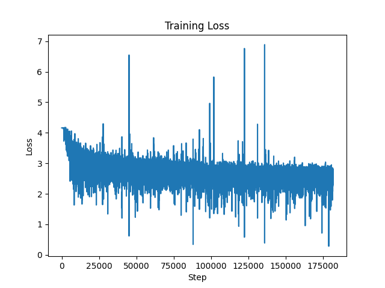
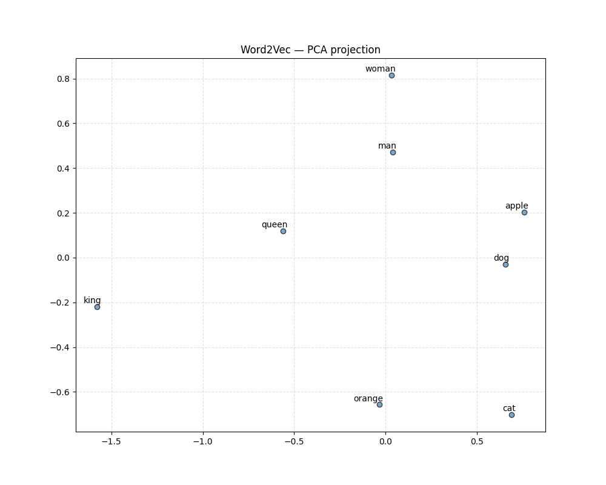
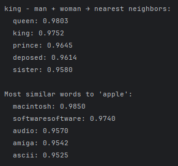

# Skip-gram Word2Vec with negative sampling, implemented from scratch in NumPy.

This is Andrei Oprescu's submission to the "Learning to Reason with Small Models" internship task

## Results

Below is the loss curve of the model learning from the enwiki text dataset.

Below are the embeddings of some words after PCA was applied for visualization purposes.

I also decided to prove the 'king - man + woman => queen' analogy. By doing this calculation using the vector embeddings of the words, these are the top 5 closest neighbors:
Additionally, I also looked at the closest neighbors of the word 'apple':

## Running the project

To run the project, you will need the following two dependencies installed:
pip install numpy 
pip install matplotlib

Then to run the training loop and get the visualizations:
python main.py

## Project structure

preprocess.py  - tokenization, subsampling, negative sampling table
model.py       - forward pass, gradients, parameter updates
main.py        - training entry point and evaluation

## Implementation Details

The model implements skip-gram with negative sampling (SGNS). Rather than computing softmax over the full vocabulary, each training step is a binary classification: is this a (center, context) pair real or noise? This makes training fast enough to run on CPU.

**Objective**

$$L = -\log \sigma(v_c \cdot u_{pos}) - \sum_{k=1}^{K} \log \sigma(-v_c \cdot u_{neg_k})$$

The first term pulls center and context vectors together; the sum pushes the center away from $K$ noise vectors sampled from the unigram distribution.

**Gradients**

With $\sigma_+ = \sigma(v_c \cdot u_{pos})$ and $\sigma_k = \sigma(v_c \cdot u_{neg_k})$:

$$\frac{\partial L}{\partial u_{pos}} = (\sigma_+ - 1) \cdot v_c \qquad \frac{\partial L}{\partial u_{neg_k}} = \sigma_k \cdot v_c \qquad \frac{\partial L}{\partial v_c} = (\sigma_+ - 1) \cdot u_{pos} + \sum_{k} \sigma_k \cdot u_{neg_k}$$

The $(\sigma - \text{label})$ error terms fall out naturally from the derivative of log-sigmoid — the same pattern as binary cross-entropy.

**Subsampling & Negative Sampling**

Frequent words are downsampled with $P(\text{keep}) = \sqrt{t / f(w)}$, which roughly halves corpus size and improves quality for mid-frequency words. Negative samples are drawn from $f(w)^{0.75}$, which flattens the distribution enough that rare words get sampled meaningfully without making it uniform.

---

## Known Limitations

- **`np.add.at` is slow** — correct for duplicate IDs in a batch, but not vectorized. A faster approach accumulates into a dense gradient matrix and does a single update.
- **No negative filtering** — the true context word can be drawn as a negative sample, which is the same approximation the original C implementation makes.
- **No hierarchical softmax** — worth noting that it generally outperforms SGNS for rare words.
